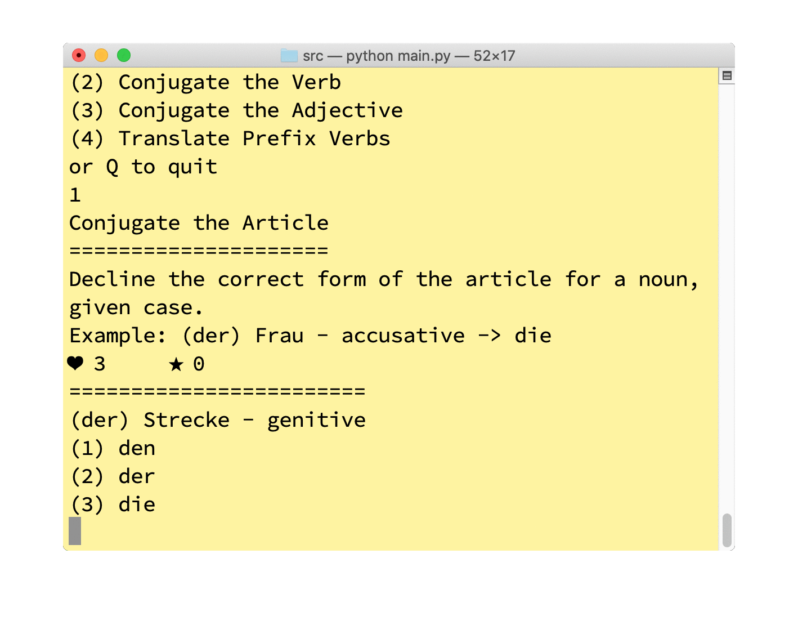
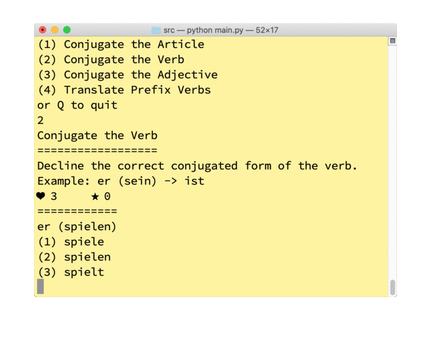
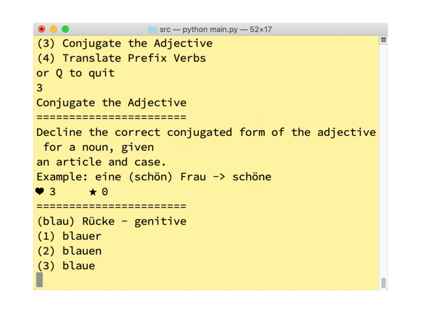
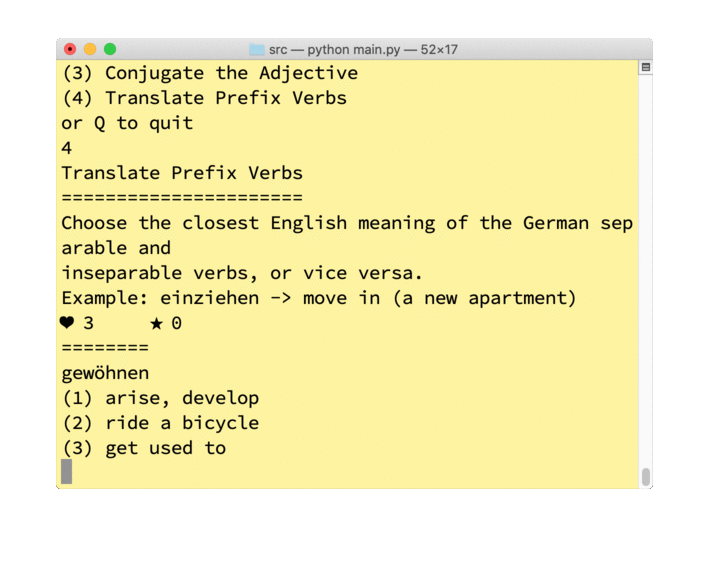

# German Language Games

## Introduction

I was learning German with Duolingo, but Duolingo unfortunately does not provide grammar practices. Furthermore, the internet's resources on *free* grammar exercises are not only limited, but also less than ideal, because the vocab used in the grammar exercises is sometimes beyond my level at the time, so a grammar practice session could become a vocab learning session. I need practices that are repetitive and customizable depending on my existing vocab knowledge. Therefore, I took the matter into my own hands, and created grammar practices for myself.

German Language Games is a collection of games to help me learn German grammar and vocab more efficiently, to be played in the Terminal (MacOS). It integrates the vocab list from Duolingo and from custom vocab lists (e.g., list of prefix verbs from [Grimm Grammar](https://coerll.utexas.edu/gg/gr/index.html)).

## Games

### Conjugate the Article

Conjugate/decline the article or determiner, given a noun, form of the determiner (der, ein, kein, etc.), and case (e.g., nominative)

### Conjugate the Verb

Conjugate the verb in the present tense (for now), given a verb and pronoun.

### Conjugate the Adjective

Conjugate/decline the adjective, given a noun and an article.

### Translate Prefix Verbs

Choose the closest translation of the prefix.

## Features

* Integration with Duolingo
* Expansion with custom csvs

## Installation: TBD

## Requirements

* [gender-determinator v0.2.1](https://pypi.org/project/gender-determinator/)
* [pattern v3.6](https://github.com/clips/pattern/wiki/pattern-de)
* [Duolingo API](https://github.com/KartikTalwar/Duolingo)

## To Do

* [x] Finish Settings
* [x] Refactor Controller into template
* [x] Implement DeclineAdj, TranslateSeparables
* [x] Docstring, type hints
* [x] Update UML
* [ ] Error handling
* [ ] Unit testting
* [ ] Package
